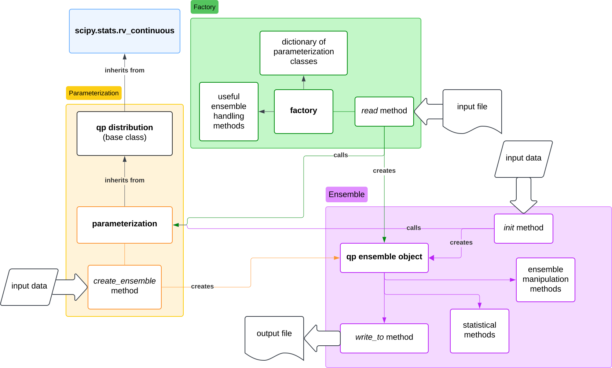

# Code Structure

`qp` is split up into two main sections: `core` for the main functionality and `parameterizations` for the classes and supporting functions for each parameterization type.

- core
  - `Ensemble`: the primary code object
  - `factory.py`: supporting functionality, wraps `scipy.stats` distributions as `qp` parameterizations, stores dictionary of all available parameterizations
- parameterizations
  - `base.py`: contains the base classes that all parameterization classes must inherit from
  - parameterization classes: contain the attributes and functions specific to that parameterization



- diagram of how the code is structured
- short description of the code and how it works, etc

Below is a diagram of the current code structure, and some descriptions of the purpose of files and folders.

```bash

qp
├── __init__.py
├── _version.py
├── core
│   ├── __init__.py
│   ├── ensemble.py
│   ├── factory.py
│   └── lazy_modules.py
├── metrics # this module contains functions to calculate metrics on qp objects
│   ├── __init__.py
│   ├── array_metrics.py
│   ├── base_metric_classes.py
│   ├── brier.py
│   ├── concrete_metric_classes.py
│   ├── factory.py
│   ├── goodness_of_fit.py
│   ├── metrics.py
│   ├── parallel_metrics.ipynb
│   ├── pit.py
│   ├── point_estimate_metric_classes.py
│   └── util_funcs.py
├── parameterizations # contains code for all parameterizations
│   ├── __init__.py
│   ├── analytic_parameterizations # code for analytic parameterizations
│   │   ├── __init__.py
│   │   ├── mixmod # mixed model Gaussian parameterization
│   │   │   ├── __init__.py
│   │   │   ├── mixmod.py
│   │   │   └── mixmod_utils.py
│   ├── base.py # base classes for all parameterizations
│   ├── hist # histogram parameterization
│   │   ├── __init__.py
│   │   ├── hist.py
│   │   └── hist_utils.py
│   ├── interp # interpolated parameterization
│   │   ├── __init__.py
│   │   ├── interp.py
│   │   └── interp_utils.py
│   ├── packed_interp # interpolated parameterization stored as packed integers
│   │   ├── __init__.py
│   │   ├── packed_interp.py
│   │   └── packing_utils.py
│   ├── quant # quantile parameterization
│   │   ├── __init__.py
│   │   ├── abstract_pdf_constructor.py # base constructor class
│   │   ├── cdf_spline_derivative.py # constructor class
│   │   ├── dual_spline_average.py # constructor class
│   │   ├── piecewise_constant.py # constructor class
│   │   ├── piecewise_linear.py # default constructor class
│   │   ├── quant.py
│   │   └── quant_utils.py
│   ├── sparse_interp # sparse parameterization
│   │   ├── __init__.py
│   │   ├── sparse.py
│   │   ├── sparse_rep.py
│   │   └── sparse_utils.py
│   └── spline # spline parameterization
│       ├── __init__.py
│       ├── spline.py
│       └── spline_utils.py
├── plotting.py # creates plots
├── utils # utility functions used throughout qp
│   ├── __init__.py
│   ├── array.py # performing array operations
│   ├── conversion.py # utilities for converting between parameterizations and unused functions
│   ├── dictionary.py # performing dictionary operations
│   ├── interpolation.py # interpolation functions
└── version.py

```
