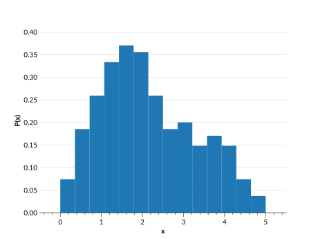

# Histogram

## Introduction

A histogram represents a distribution using two sets of data: a set of bin edges, and a set of data values within those bins. An example is plotted below.



The histogram parameterization is ideal for distributions derived from real data, particularly those that do not follow a smooth curved line. However, a histogram distribution is highly dependent on the bin widths, and in an `Ensemble` all distributions must have the same bins, so keep in mind that the bins of an `Ensemble` must work for all of its distributions.

All histogram distributions must be normalized, such that the total area of the histogram bins is equal to 1. If they are not, then the calculations of the distribution CDF, etc will not be accurate. By default, the parameterization normalized given data. If you know that your data is already normalized, you can speed up the process slightly by setting `norm = True`, which will assume that the input data is already normalized.

`Ensemble.pdf()` values are not interpolated, they are given by the PDF values in each bin, and are equal to 0 outside of the bins. `Ensemble.cdf()` values are interpolated across the bins, and return either 0 or 1 as appropriate outside of the bins. The `Ensemble.ppf()` function will not provide values outside the bin edges. So `Ensemble.ppf(0)` returns the first bin edge, and `Ensemble.ppf(1)` returns the last bin edge.

### Creating an Ensemble

The recommended method for creating a histogram `Ensemble` is to use the [`create_ensemble`](#qp.hist_gen.create_ensemble) method of the `hist` parameterization class. A quick example is provided below, along with the required and optional arguments. For more details on creating an `Ensemble`, see <project:basicusage.md#creating-an-ensemble>, and for more details on this function see its [API documentation](#qp.hist_gen.create_ensemble).

**Required parameters**: `bins`, `pdfs`

**Optional parameters**: `ancil`, `norm`, `warn`

```{doctest}

>>> import qp
>>> import numpy as np
>>> bins = np.linspace(0,1,5)
>>> pdfs = np.array([0.1,0.2,0.2,0.1])
>>> ens = qp.hist.create_ensemble(bins=bins,pdfs=pdfs)

```

## Data structure

The data structure of an `Ensemble` of histograms follows the basic structure laid out in <project:datastructure.md>. The **ancillary data** table has the exact same structure. Here we go over the specifics of the **metadata** table and the **data** table, which have keys specific to this parameterization.

### Metadata table

The **metadata** table is a dictionary of arrays. For a histogram it contains the additional coordinates key "bins", which gives the **bin edges**, not the bin centers. The length of this array should be `nbins`+1, where `nbins` is the number of bins. An example is shown below:

| key           | value              |
| ------------- | ------------------ |
| "pdf_name"    | `array(b["hist"])` |
| "pdf_version" | `array([0])`       |
| "bins"        | `array([0,1,2,3])` |

### Data table

The **data** table is a dictionary with one key, the "pdfs", which give the values within each bin. The shape of the array is (`npdf`, `nbins`), where `nbins` is the number of bins, or the number of bin edges - 1. An example for an `Ensemble` with 3 distributions:

| key    | value                              |
| ------ | ---------------------------------- |
| "pdfs" | `array([[4,5,6],[1,2,3],[7,8,9]])` |

## Conversion

There are two methods that can be used to convert an `Ensemble` to this parameterization: the [default method](#qp.parameterizations.hist.hist_utils.extract_hist_values), and [samples](#qp.parameterizations.hist.hist_utils.extract_hist_samples).

### Default method ([`extract_hist_values`](#qp.parameterizations.hist.hist_utils.extract_hist_values))

**Required argument:** `bins`, where `bins` are the bin edges of the histogram.

The default method works by taking the current distribution, getting the CDF values at each of the bin edges, and then taking the difference across the bins to get the value for each bin. This method works well if the CDF of the input distribution is well defined, but if it has been interpolated across widely spaced values the second method may give better results.

### Samples method ([`extract_hist_samples`](#qp.parameterizations.hist.hist_utils.extract_hist_samples))

**Required argument:** `bins`, where `bins` are the bin edges of the histogram.

**Optional argument:** `size`, which is the number of values to sample from the distribution

This method samples from the input distribution, and then uses `np.histogram` to create a histogram from these samples, using the provided `bins` as bin edges. This does mean that too few samples may result in quite a different distribution, so it is recommended to use a large number of samples.
