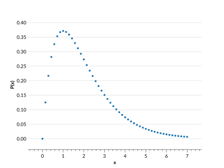

# Irregular interpolation

Irregular interpolated distributions are defined with:

- **$x$ values** (`xvals`): $n$ ordered values representing coordinates on a distribution.
- **$y$ values** (`yvals`): $n$ values that correspond to the probability associated with each $x$ value.



## Use cases

The irregular interpolation parameterization works well for distributions derived from real data, particularly those that may not occupy the same range of values, or that require variable density of $x$ values for each distribution.

```{warning}

This distribution can be quite slow when given many distributions with lots of $x$ values for each distribution. If you have a set of distributions that can be represented by a shared set of $x$ values, use the <project:interp.md> parameterization instead.

```

## Behaviour

Interpolated `Ensembles` operate in the following way:

- `Ensemble.pdf(x)` uses `scipy.interpolate.interp1d` to linearly interpolate the PDF inside the range of given `xvals`, and returns 0 outside that range.
- `Ensemble.cdf(x)` uses `scipy.interpolate.interp1d` to linearly interpolate the CDF from the cumulative sum at the given `xvals`. It is not the direct integral of `Ensemble.pdf()`. Outside the range of given `xvals` it returns 0 or 1 as appropriate.
- `Ensemble.ppf(x)` uses `scipy.interpolate.interp1d` to linearly interpolate based on the cumulative sum at the given `xvals`, with the x and y inputs inverted.

## Data structure

See <project:../datastructure.md> for general details on the data structure of `Ensembles`.

### Metadata Dictionary

| Key           | Example value                  | Description                           |
| ------------- | ------------------------------ | ------------------------------------- |
| "pdf_name"    | `array(b["interp_irregular"])` | The parameterization type             |
| "pdf_version" | `array([0])`                   | Version of parameterization type used |

### Data Dictionary

| Key     | Example value                            | Description                                                           |
| ------- | ---------------------------------------- | --------------------------------------------------------------------- |
| "xvals" | `array([0,1,2],[-3,-2,-1],[10,10.5,11])` | The $x$ values for each distributions, of shape ($n_{pdf}$,$n$)       |
| "yvals" | `array([[4,5,6],[1,2,3],[7,8,9]])`       | The values corresponding to each $x$ value, of shape ($n_{pdf}$, $n$) |

```{note}
$n_{pdf}$ is the number of distributions in an `Ensemble`.
```

## Ensemble creation

```{doctest}

>>> import qp
>>> import numpy as np
>>> xvals = np.linspace(0,1,5)
>>> yvals = np.random.rand(2,5)
>>> ens = qp.interp.create_ensemble(xvals=xvals, yvals=yvals)
>>> ens
Ensemble(the_class=interp,shape=(1,5))

```

**Required parameters:**

- `xvals`: The array containing the ($n_{pdf}$,$n$) $x$ values for each of the distributions
- `yvals`: The array containing the ($n_{pdf}$,$n$) probability values corresponding to each $x$ value.

**Optional parameters:**

- `ancil`: The dictionary of arrays of additional data containing $n_{pdf}$ values
- `norm`: If True, normalizes the input distributions. If False, assumes the given distributions are already normalized. By default True.
- `warn`: If True, raises warnings if input is not valid PDF data (i.e. if data is negative). If False, no warnings are raised. By default True.

For more details on creating an `Ensemble`, see <project:../basicusage.md#creating-an-ensemble>, and for more details on this function see its [API documentation](#qp.interp_irregular_gen.create_ensemble).

## Conversion
