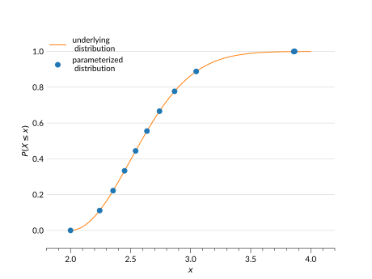

# Quantile

Quantile distributions are parameterized by values from the CDF. They have:

- **quantiles** (`quants`): $n$ ordered quantiles of the distribution, from 0 to 1. These are evenly spaced cumulative probabilities (i.e. the probability $x \leq$ some value.)
- **locations** (`locs`): The $n$ locations, or x values, on the distribution's CDF where the quantiles are reached.



## Use cases

The quantile parameterization works well for data that has a well-behaved CDF. It is easy to represent a range of data without worrying about choosing an appropriate range, as all distributions must have quantiles between 0 and 1.

- do we discuss the issues at the edges and of interpolation method here? I think yes, in addition to mentioning interpolations can go negative in known issues section.

## Behaviour

Quantile parameterized `Ensembles` behave in the following ways:

- `Ensemble.cdf(x)` is created by interpolating quadratically between the quantiles using `scipy.interpolate.interp1d`.
- `Ensemble.ppf(0)` returns negative infinity and `Ensemble.ppf(1)` returns positive infinity.
- `Ensemble.pdf(x)` is calculated in a variety of ways depending on the PDF constructor used (`pdf_constructor_name`, described below).
  - **piecewise_linear** (_Default_): Takes the numerical derivative of the CDF and linearly interpolates between those points.
  - **piecewise_constant**:
  - **cdf_spline_derivative**: Uses `scipy.interpolate.InterpolatedUnivariateSpline` to fit a cubic spline to quantiles and locations, and then gets the derivative of that spline which provides the PDF values. See {py:class}`CdfSplineDerivative <qp.parameterizations.quant.cdf_spline_derivative.CdfSplineDerivative>` for more details.
  - **dual_spline_average**: Solves for the PDF with a stepwise algorithm, then uses these values to create an upper bound and lower bound cubic spline of the PDF, which are then averaged to produce the PDF. See {py:class}`DualSplineAverage <qp.parameterizations.quant.dual_spline_average.DualSplineAverage>` for more details.

## Data structure

See <project:../datastructure.md> for general details on the data structure of `Ensembles`.

### Metadata Dictionary

| Key                    | Example value                  | Description                                        |
| ---------------------- | ------------------------------ | -------------------------------------------------- |
| "pdf_name"             | `array(b["quant"])`            | The parameterization type                          |
| "pdf_version"          | `array([0])`                   | Version of parameterization type used              |
| "pdf_constructor_name" | `array(b["piecewise_linear"])` | Version of the PDF constructor algorithm used.     |
| "ensure_extent"        | `array([True])`                | Value of the `ensure_extent` parameter used.       |
| "quants"               | `array([0,0.25,0.5,0.75,1.])`  | The $n$ quantiles shared across all distributions. |

### Data Dictionary

| Key    | Example value                                          | Description                                                          |
| ------ | ------------------------------------------------------ | -------------------------------------------------------------------- |
| ";pcs" | `array([[2,4,5,6,8],[0.5,1,2,3,3.5],[6.8,7,8,9,9.5]])` | The values corresponding to each quantile, of shape ($n_{pdf}$, $n$) |

```{note}
$n_{pdf}$ is the number of distributions in an `Ensemble`.
```

## Ensemble creation

```{doctest}

>>> import qp
>>> import numpy as np
>>> quants = np.linspace(0,1,5)
>>> locs = np.array([np.linspace(1,3,5),np.linspace(5,7,5)])
>>> ens = qp.quant.create_ensemble(quants=quants,locs=locs)
>>> ens
Ensemble(the_class=quant,shape=(2,5))

```

**Required parameters**:

- `quants`: The array containing the $n$ quantiles to use for each distribution.
- `locs`: The array containing the ($n_{pdf}$, $n$) $x$ values or coordinates where the quantiles are reached.

**Optional parameters**:

- `ancil`: The dictionary of arrays of additional data containing $n_{pdf}$ values
- `pdf_constructor_name`: The construction algorithm used to create the PDF, by default "piecewise_linear". The options are: "piecewise_linear", "piecewise_constant", "cdf_spline_derivative", and "dual_spline_average".
- `ensure_extent`: If True, ensures that the quants start at 0 and end at 1 by linearly interpolating data points at the edges of the given data as necessary until the quants extend from 0 to 1. By default True.
- `warn`: If True, raises warnings if input is not valid PDF data (i.e. if data is negative). If False, no warnings are raised. By default True.

For more details on creating an `Ensemble`, see <project:../basicusage.md#creating-an-ensemble>, and for more details on this function see its [API documentation](#qp.quant.create_ensemble).

## Conversion

There is only one method to convert an `Ensemble` to this parameterization: {py:func}`extract_quantiles() <qp.parameterizations.quant.quant_utils.extract_quantiles>`.

**Example:**

```{doctest}

>>> ens_q = qp.convert(ens, 'quant', quants=np.linspace(0.001,0.999,5))
>>> ens_q
Ensemble(the_class=quant,shape=(2,5))

```

**Required argument:** `quants`, the $n$ quantiles at which to evaluate each distribution.

The conversion function calls the `ppf()` method of the input `Ensemble` at the given quantiles, and then uses the returned values with the given quantiles to create a new quantile parameterized `Ensemble`. This will use all of the defaults for optional parameters.

```{warning}

We recommend you do not include 0 and 1 in your input quantiles for conversion from **most** parameterizations. All of the `qp` exclusive parameterizations return infinite values at `ppf(0)` and `ppf(1)`, and many of the `scipy.stats.rv_continous` distributions do as well (i.e. a normal distribution). Instead, do as in the example above and input quantiles that extend from some value close to 0 to a value close to 1.

```

## Known issues

- The interpolated PDF is not constrained to have only positive values, so it may contain negative values. This is particularly likely with the "cdf_spline_derivative" and "dual_spline_average" PDF constructors.
